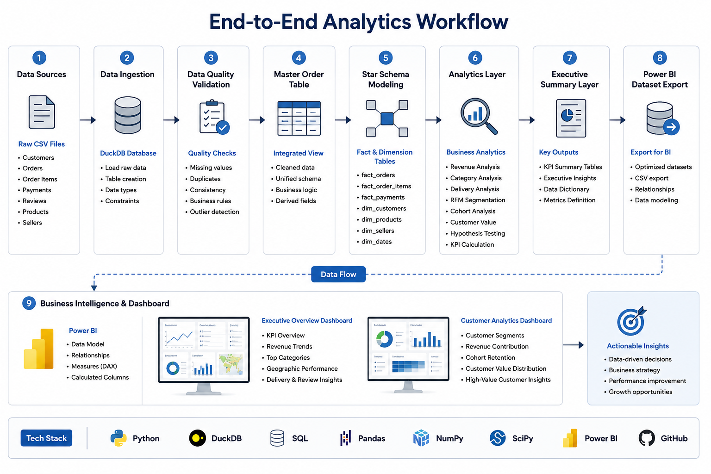
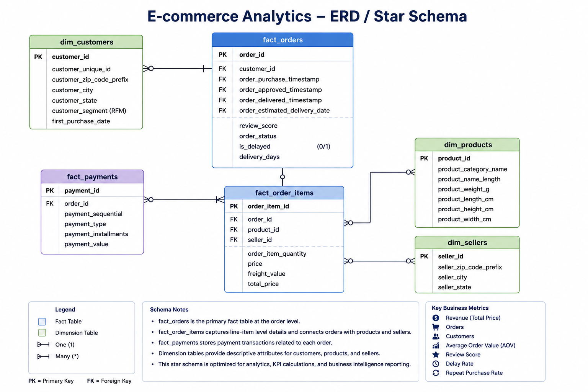
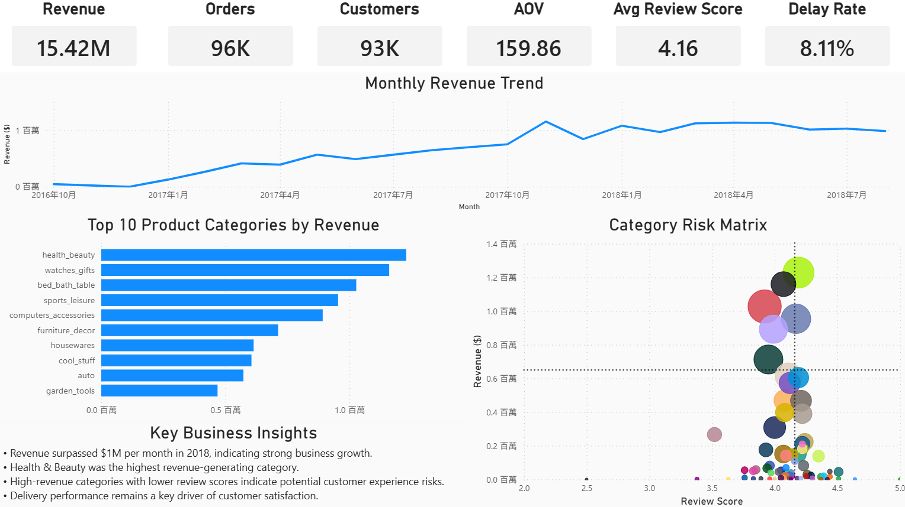
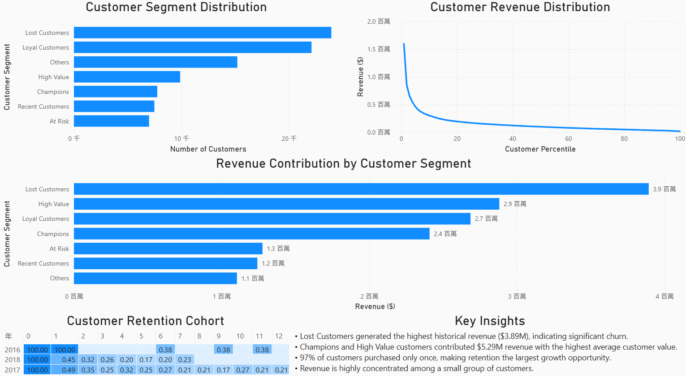

# 電商營收成長分析（E-commerce Revenue Growth Analysis）

[🇺🇸 English](README.md) | [🇹🇼 繁體中文](README.zh-TW.md)

## 專案概述

本專案以電商平台的交易資料、顧客資料與營運資料為基礎，透過資料分析方法探討影響營收成長、顧客留存與顧客滿意度的關鍵因素。

專案使用 SQL、DuckDB、Python 與 Power BI 建立完整的端到端（End-to-End）分析流程，從原始資料建置資料倉儲、進行資料驗證與商業分析，最終產出管理決策儀表板與商業建議。

本專案展示了資料分析師（Data Analyst）、商業智慧分析師（Business Intelligence Analyst）及產品分析師（Product Analyst）常見的核心能力。

---

## 專案背景與分析目標

許多電商企業將資源集中於獲取新客戶，但長期成長往往取決於顧客留存率、營運效率與顧客體驗。

本專案希望透過資料分析回答以下問題：

### 營收成長分析

* 平台營收是否持續成長？
* 哪些產品類別貢獻最高營收？
* 營收成長的主要驅動因素為何？

### 顧客分析

* 哪些客戶創造最高商業價值？
* 營收是否集中於少數高價值客戶？
* 平台顧客留存狀況如何？

### 營運績效分析

* 物流配送是否影響顧客滿意度？
* 哪些產品類別具有潛在營運風險？
* 有哪些改善顧客體驗與留存率的機會？

---

## 分析範圍

本專案涵蓋以下分析主題：

* 資料倉儲設計（Data Warehouse Design）
* 資料品質驗證（Data Validation）
* KPI 指標設計
* 顧客分群分析（RFM Segmentation）
* Cohort 留存分析
* 營收集中度分析
* 統計假設檢定
* Power BI 商業儀表板開發

---

## 資料集說明

### 資料來源

Olist Brazilian E-Commerce Public Dataset

### 資料規模

* 96K+ 已完成訂單
* 93K+ 顧客資料
* 110K+ 訂單品項
* 100K+ 付款紀錄
* 100+ 商品類別
* 顧客評價資料
* 物流配送資料

### 分析領域

* 營收分析（Revenue Analytics）
* 顧客分析（Customer Analytics）
* 營運分析（Operational Analytics）

### 資料集取得方式

原始資料集可於 Kaggle 公開取得。

由於 GitHub 儲存空間限制，本專案不包含原始資料檔案。

資料集來源：

https://www.kaggle.com/datasets/olistbr/brazilian-ecommerce

下載完成後，請將所有 CSV 檔案放置於：

```text
data/raw/
```
本專案提供完整的資料處理流程，系統將自動建立 DuckDB 資料庫、Star Schema 資料模型，以及後續分析所需的資料集。

使用者僅需下載原始資料並放置於指定目錄，即可重現完整分析流程。

---

## 資料架構設計

### End-to-End Analytics Workflow

本專案建立完整資料分析流程，從原始交易資料出發，經過資料建模、資料驗證、商業分析與視覺化呈現，最終形成決策支援資訊。



### Star Schema 資料模型

為了支援商業分析與儀表板查詢效能，本專案採用 Star Schema 架構設計資料模型。

主要資料表包含：

* Fact Orders
* Fact Order Items
* Fact Payments
* Customer Dimension
* Product Dimension
* Seller Dimension

透過將交易事實資料（Fact Tables）與描述性維度資料（Dimension Tables）分離，提升分析彈性與查詢效率。
此架構亦能支援大型資料聚合運算，並作為商業報表、顧客分析與 KPI 計算的基礎架構。



---

## 專案展示

### Executive Overview



### Customer Analytics



### Dashboard 操作示範

以下 GIF 示範 Power BI Dashboard 的操作流程，包含 KPI 指標瀏覽、顧客分群分析、營收分析與 Cohort 留存分析等功能。


---

## Dashboard

Power BI 互動式商業儀表板

目前正在規劃 Power BI Service 部署，未來將提供線上互動版本。

---

## 專案成果亮點

* 分析超過 96K 筆訂單與 93K 位顧客資料
* 發現 97% 顧客僅購買一次，顯示留存率是主要成長機會
* 發現前 20% 顧客貢獻 53.54% 平台營收
* 驗證延遲配送與顧客滿意度下降具有顯著關聯
* 建立 RFM 顧客分群模型辨識高價值客群
* 建立 DuckDB 資料倉儲與 Star Schema 架構
* 建立資料驗證流程確保分析品質
* 建立資料字典（Data Dictionary）提升資料治理能力
* 建置 Power BI 管理決策儀表板

### 核心指標成果

| 指標         |       數值 |
| ---------- | -------: |
| 總營收        |  $15.42M |
| 訂單數        |   96,469 |
| 顧客數        |   93,349 |
| 平均客單價      |  $159.86 |
| 平均評價分數     | 4.16 / 5 |
| 延遲配送率      |    8.11% |
| 回購率        |     3.0% |
| 延遲配送平均評分   |     2.57 |
| 準時配送平均評分   |     4.29 |
| 前20%顧客營收占比 |   53.54% |

---

## 分析流程

### 1. 資料建模

* 建立 Fact Tables 與 Dimension Tables
* 設計 Star Schema 資料模型

### 2. 資料驗證

* 驗證資料一致性
* 檢查重複紀錄
* 驗證 Cohort 計算邏輯

### 3. KPI 指標建置

* 營收指標
* 顧客指標
* 配送指標
* 顧客滿意度指標

### 4. 顧客分析

* RFM 顧客分群
* Cohort 留存分析
* 營收集中度分析
* 顧客價值分布分析

### 5. 商業智慧分析

* Executive Dashboard
* Customer Analytics Dashboard

### 6. 商業建議

* 將分析結果轉換為可執行的商業策略

---

## 商業價值與發現

### 顧客留存

* 97% 顧客僅購買一次
* 回購顧客比例僅 3%
* 提升顧客留存率是最具潛力的成長機會

### 配送績效

* 延遲配送平均評價為 2.57
* 準時配送平均評價為 4.29
* 改善物流績效有助於提升顧客滿意度

### 高價值客戶經營

* 前 20% 顧客創造超過一半營收
* CRM 與會員經營應優先聚焦高價值客群

---

## 展示技術能力

### SQL 與資料倉儲

* DuckDB
* Analytical SQL
* Star Schema Modeling
* Fact & Dimension Design

### 商業分析

* KPI 設計
* 營收分析
* 顧客分析
* 營運績效分析
* Root Cause Analysis
* Hypothesis-Driven Analysis
* 統計假設檢定
* Welch's t-test

### 顧客分析

* RFM Segmentation
* Cohort Analysis
* Customer Value Analysis
* Revenue Concentration Analysis

### 商業智慧

* Power BI
* Dashboard Design
* Executive Reporting
* Data Storytelling

### 資料工程

* ETL Workflow
* Data Validation
* Data Quality Investigation
* Data Dictionary
* Reproducible Analytics Pipeline

---

## 技術架構

### 程式語言

* Python
* SQL

### 資料分析

* Pandas
* NumPy
* SciPy

### 資料倉儲

* DuckDB

### 商業智慧

* Power BI

### 版本控制

* Git
* GitHub

---

## 重要商業洞察

### 營收成長

2018 年期間平台單月營收突破 100 萬美元，顯示平台具有明顯成長趨勢。

### 品類績效

Health & Beauty 為營收最高商品類別。

部分高營收品類同時具有較低評價分數，可能存在產品品質或配送體驗問題。

### 顧客集中度

前 20% 顧客創造約 53.54% 營收，顯示平台營收具有中度集中現象。

### 顧客留存

大多數顧客僅進行一次購買，留存率為平台最重要改善方向。

### 配送績效

延遲配送顯著降低顧客評價，顯示物流績效對顧客體驗具有直接影響。

---

## 分析成果產出（Analytics Results）

本專案產出多項可直接支援商業決策的分析成果：

| 分析成果                    | 說明                           |
| ----------------------- | ---------------------------- |
| Executive KPI Summary   | 營收、訂單數、顧客數、客單價、評價分數與延遲率等核心指標 |
| Revenue Analysis        | 月營收趨勢分析與州別營收表現分析             |
| Customer Segmentation   | RFM 顧客分群與營收貢獻分析              |
| Cohort Analysis         | 顧客留存率分析                      |
| Customer Value Analysis | 顧客價值分布與營收集中度分析               |
| Statistical Validation  | 配送績效與顧客滿意度之統計假設檢定            |
| Executive Insights      | 商業成長與留存改善建議                  |

上述分析成果皆已匯出為可重複使用之分析資料集，並整合至 Power BI Dashboard 中供管理決策使用。

---

## 專案特色（Repository Features）

本專案以可重現（Reproducible Analytics Project）為設計核心。

主要特色包含：

* DuckDB 自動化資料庫建置
* Star Schema 分析模型
* 資料品質驗證機制
* KPI 計算流程
* 顧客分析流程
* 統計假設檢定流程
* Power BI Dataset 產出
* Data Dictionary 文件化
* 模組化 Python 分析腳本
* Git 版本控制管理

透過本專案提供的流程，使用者可從原始資料開始完整重建分析結果與 Dashboard。

---

## 未來優化方向

### 進階分析

* 顧客流失預測（Customer Churn Prediction）
* 預測式 CLV 模型
* 需求預測
* 行銷歸因分析

### 資料工程

* 自動化 ETL Pipeline
* Cloud Data Warehouse

### 商業智慧

* Power BI Service 部署
* 線上互動儀表板

### 分析自動化

* 自動資料更新
* 自動化分析報表

---

## 作者

Noah Peng

Data Analyst | SQL | Python | Power BI | Customer Analytics | Business Intelligence

國立臺北大學

現職：

Data Analyst (Industrial Analytics & AI Applications)

Supporting Taiwan Power Research Institute Projects

### Connect

GitHub: https://github.com/Noahpeng829

LinkedIn: https://www.linkedin.com/in/noah-peng-7896b9374/
